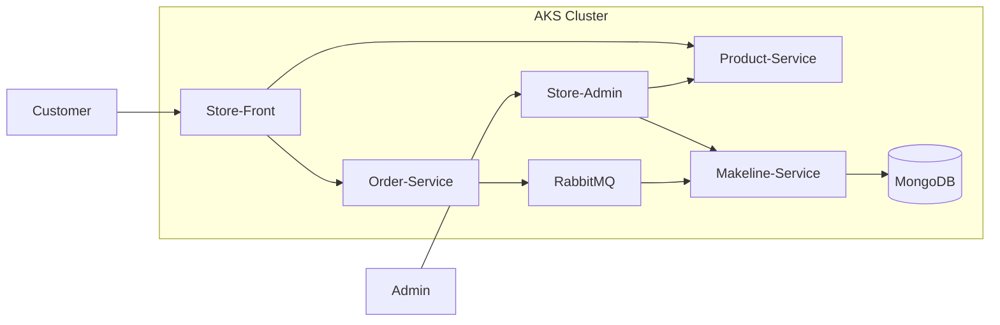

# CST8915 Final Project: Cloud-Native App for Best Buy

**Student Name**: Bosi Chen\
**Student ID**: 041040774\
**Course**: CST8915 Full-stack Cloud-native Development\
**Semester**: Winter 2026

---

## Demo Video

🎥 [Watch Demo Video](https://youtu.be/p__ChVTNbVQ)

---

## Application Explanation

### Overview

This project is a cloud-native microservices application developed as part of the CST8915 Final Project. It is based on the Algonquin Pet Store (On Steroids) architecture and simulates an online retail system similar to Best Buy.

The system is composed of multiple independently deployable services running on Azure Kubernetes Service (AKS).

### Tech Stacks

- Frontend: Vue.js
- Backend: Node.js, GO
- Database: MongoDB
- Queueing: RabbitMQ
- Deployment: AKS Cluster

### System Flow

- Customers browse products via store-front
- Orders are sent to order-service
- Orders are placed into RabbitMQ queue
- makeline-service consumes orders and stores them in MongoDB
- Admin users manage orders via store-admin

### Architecture Diagram



### Links

| Service          | Description                           | GitHub                                                                  | Docker Hub                                                                                                 |
| ---------------- | ------------------------------------- | ----------------------------------------------------------------------- | ---------------------------------------------------------------------------------------------------------- |
| store-front      | Web app for customers to place orders | [store-front-f](https://github.com/bosichen-ac/store-front-f)           | [bosichenac/store-front](https://hub.docker.com/repository/docker/bosichenac/store-front)                  |
| store-admin      | Web app for store employees           | [store-admin-f](https://github.com/bosichen-ac/store-admin-f)           | [bosichenac/store-admin](https://hub.docker.com/repository/docker/bosichenac/store-admin/general)          |
| order-service    | Handles order placement               | [order-service-f](https://github.com/bosichen-ac/order-service-f)       | [bosichenac/order-service](https://hub.docker.com/repository/docker/bosichenac/order-service)              |
| product-service  | Handles CRUD operations on products   | [product-service-f](https://github.com/bosichen-ac/product-service-f)   | [bosichenac/product-service](https://hub.docker.com/repository/docker/bosichenac/product-service)          |
| makeline-service | Processes and completes orders        | [makeline-service-f](https://github.com/bosichen-ac/makeline-service-f) | [bosicenac/makeline-service](https://hub.docker.com/repository/docker/bosichenac/makeline-service/general) |

### Deployment Instructions
1. Clone Repository
```
git clone https://github.com/YOUR_USERNAME/YOUR_REPO.git
cd YOUR_REPO
```
2. Deploy to Kubernetes
```
kubectl apply -f DeploymentFiles/
```
3. Verify Deployment
```
kubectl get pods
kubectl get services
```

## AI Tools Used

- Tool: ChatGPT
- Purpose: Debugging the frontend vue code, documentation, and explaining and generating the go language in makeline service 
- Extent: Assisted with implementation and explanations

***All code was reviewed and understood before use***

## Conclusion

This project demonstrates:

- Microservices architecture
- Containerization with Docker
- Kubernetes orchestration on AKS
- CI/CD automation with GitHub Actions

It also extends the base template with additional features such as order history tracking and improved UI, showcasing full-stack development capabilities.